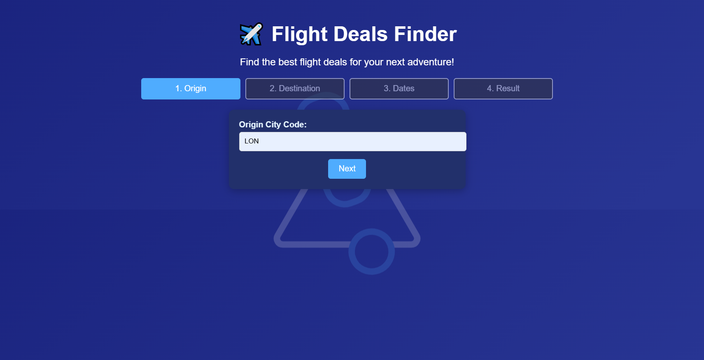
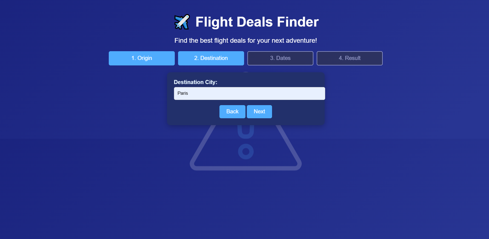
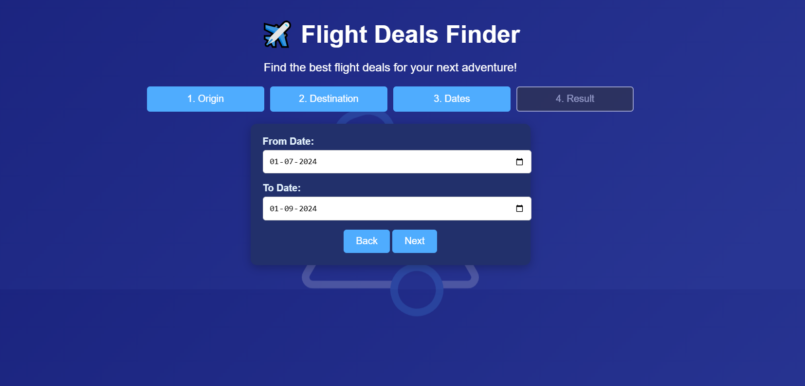

# Flight Deals Finder

Flight Deals Finder is a web application that helps users find the best flight deals for their next adventure. It integrates with the Sheety API for destination data, the Kiwi API for flight search, and Twilio for SMS notifications.

## Features

- Search for flights between cities and get the best deals.
- Step-by-step form with progress bar for a smooth user experience.
- Real-time flight data fetched from external APIs.
- SMS notifications for low-price alerts (Twilio integration).
- Responsive and modern UI.

## Project Structure

```
.
├── app.py                  # Flask web app
├── main.py                 # Script for backend flight deal checks
├── data_manager.py         # Handles data retrieval and updates from Sheety
├── flight_search.py        # Integrates with Kiwi API for flight search
├── flight_data.py          # Flight data model
├── notification_manager.py # Sends SMS notifications via Twilio
├── static/
│   ├── scripts.js          # Frontend JS logic
│   └── styles.css          # CSS styles
├── templates/
│   └── index.html          # Main HTML template
└── .idea/                  # IDE config files
```

## Setup

1. **Clone the repository**

2. **Install dependencies**
   ```sh
   pip install -r requirements.txt
   ```

3. **Set environment variables**

   Create a `.env` file in the root directory with the following keys:
   ```
   SHEETY_API_KEY=your_sheety_api_key
   SHEETY_PRICES_URL=your_sheety_prices_url
   KIWI_API_KEY=your_kiwi_api_key
   KIWI_LOCATION_URL=https://tequila-api.kiwi.com
   KIWI_SEARCH_URL=https://tequila-api.kiwi.com
   TWILIO_ACCOUNT_SID=your_twilio_account_sid
   TWILIO_AUTH_TOKEN=your_twilio_auth_token
   TWILIO_FROM_NUMBER=your_twilio_phone_number
   TWILIO_TO_NUMBER=your_verified_phone_number
   ```

4. **Run the Flask app**
   ```sh
   python app.py
   ```
   Visit [http://localhost:5000](http://localhost:5000) in your browser.

5. **(Optional) Run the backend script**
   ```sh
   python main.py
   ```

## Usage

- Use the web interface to search for flights.
- The backend script (`main.py`) can be scheduled to run periodically to check for deals and send SMS alerts.

## Notes

- Ensure your Sheety, Kiwi, and Twilio credentials are valid and active.
- The app uses environment variables for all sensitive information.
- For development, you can use mock data if API credentials are not set.


  
  
  
  
  
  
  
**Developed with Flask**
